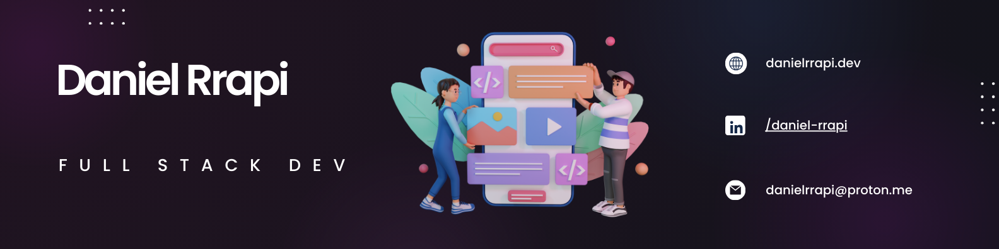

    

        
    

    

### Welcome on my Github! Here you can view all my public repositories, feel free to submit any feedback ✌️

 

### Languages, Libraries and Frameworks:

---

### Platforms:

---

### Tools:

  

---

<!--
**daniel-rrapi/daniel-rrapi** is a ✨ _special_ ✨ repository because its `README.md` (this file) appears on your GitHub profile.

Here are some ideas to get you started:

- 🔭 I’m currently working on ...
- 🌱 I’m currently learning ...
- 👯 I’m looking to collaborate on ...
- 🤔 I’m looking for help with ...
- 💬 Ask me about ...
- 📫 How to reach me: ...
- 😄 Pronouns: ...
- ⚡ Fun fact: ...
  -->
